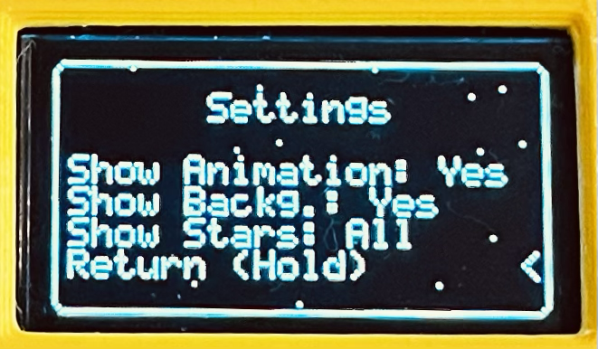

# Arduino Flappy Bird Console

This project is a simple handheld Flappy Bird–inspired game built using an Arduino (ATmega328P Chip) and a 7-pin SPI display. It recreates the classic side-scrolling obstacle-avoidance gameplay in a compact embedded system.

The PCB is the intended way to build this project, though the non PCB version is a good way to try it out first. You can find the components needed to build the non PCB version at [Non PCB Version](#non-pcb-version).

Curious how it's built? Watch the video below (btw this is v1 build that is why it looks a little different):

## Table of Contents

- [Version 2 Release](#version-2-release)
- [Features](#features)
- [Game Mechanics](#game-mechanics)
- [Game Completion Score](#game-completion-score)
- [Settings Menu](#settings-menu)
- [PCB](#pcb)
  - [PCB Parts](#pcb-parts)
  - [PCB Schematic](#pcb-schematic)
- [3D Printed Case](#3d-printed-case)
- [Non PCB Version](#non-pcb-version)
  - [Typical Display Pinout](#typical-display-pinout)
  - [Button Pinout](#button-pinout)
- [Software Requirements](#software-requirements)
- [Installation](#installation)
- [License](#license)
- [Contributing](#contributing)

## Version 2 Release

V2 adds a lot of new features like:

- A redesigned case
- A game progression system (difficulty unlocks, Endless Mode, etc.)
- Settings menu for visual options
- Landing/takeoff animations
- Better UI, etc.

All the new additions are marked (**New in V2**)

## Features

- Smooth side-scrolling graphics on a 7-pin SPI display
- Single-button control
- Game and level progression system (**New in V2**)
- Landing and takeoff animation (**New in V2**)
- Settings menu to adjust visual settings. Extra elements like animations, backgrounds and star filled skies can be toggled off to increase performance. See [Settings Menu](#settings-menu) (**New in V2**)
- Stylish UI (**New in V2**)
- Small form factor futuristic case for easy play on the go
- Up to a 36 hours of play time on a single charge (with a 400mAh battery)
- On screen battery indicator
- Spot for a keychain ring to carry on the go (**New in V2**)
- Lightweight game loop optimized for microcontrollers
- Fully open-source hardware and software
- For more features see [Game Mechanics](#game-mechanics)

## Game Mechanics

- There are three difficulties: Steady, Rush, Frenzy (Easy, Medium, Hard). (**New in V2**)
- Each press of the button makes the bird flap upward.
- Gravity continuously pulls the bird downward.
- Collision with the ground, ceiling, or a pipe ends the game.
- Time your flaps to pass between pipes, each pipe is worth 1 point. But be careful the more points you get the harder the game becomes.
- All high scores for all the difficulties are saved in EEPROM and do not reset.
- Upon reaching a certain amount of points you clear the difficulty. See [Game Completion Score](#game-completion-score) for more info. (**New in V2**)
- After clearing the difficulty you have the ability to play the **ENDLESS MODE**. Try to get as far as possible with no mistakes while the game is trying its best to make you fail. (**New in V2**)
- Harder difficulties are locked by default, clear previous difficulties to unlock further ones. (**New in V2**)

## Game Completion Score

Completing a game is one of the most satisfying things you can experience. So it is important to set the completion score appropriately. The default score to beat is 50 points for each difficulty level, this is an amount that most people can achieve and i advise you to start out with this score and possibly increase it higher(75, 100, etc.) later. This way you can experience all the game difficulties and then play the ones you like and try getting higher scores in Endless mode.

However be warned if increasing the score, you are probably going to experience performance issues(especially on higher difficulties) and you might feel like the game is stuttering and periodically slowing down. This is mostly linked to the amount of sprites that are drawn to the screen each frame. See [Settings Menu](#settings-menu) to see how you can mitigate this issue.

## Settings Menu

In v2 the Settings menu was implemented to combine the ability of playing the game with cool graphics and being able to maximize performance for Endless mode runs.

As shown above the settings and their respective options are:

- Show Animation: Show the Landing and Takeoff animation (Does not impact game performance)
  - Yes -> Yes show the landing and takeoff animation
  - No -> No do not show the landing and takeoff animation

- Show Background: Show the Moon surface during gameplay
  - Yes -> Yes show the moon surface
  - No -> No do not show the moon surface

- Show Stars: Show the starry sky background
  - All -> Show the stars in the menu and in the gameplay
  - Menu -> Just show the stars in the menu (Does not impact game performance)
  - No -> Do not show stars at all

While having all of the options on does make the game look the best it does have a cost and that is end game performance. So if you are trying to get a high score and are running into performance issues it is advised that you turn off some of the settings. It is recommended to turn off the "Show Background" option first as that has by far the biggest performance cost and then to turn off the "Show Stars" option.

## PCB

### PCB Parts

For a full list of all the needed parts please refer to the BOM file(Read notes below). If you just want a quick glance the needed components can be found below.

(Note: I could not find a switch footprint so in the BOM the switch is represented as a header(H2). Almost any 6 pin switch with the same pin pitch as the header will fit in the case and work.)

(Note 2: The first header(H1) will not fit in the case!! Either the pins need to be desoldered after or the firmware needs to be uploaded without soldering the connector. You can do that by placing the header into the programmer and angling the pcb so that the header makes contact.)

(Note 3: When flashing the firmware to the PCB you might have stability problems when running on lower voltage. In that case you can try to flash the MCU to use the internal 8MHz clock signal or try a different IC / charging the battery.)

- **ATmega328P Chip**
- **A 16MHz SMD Crystal Oscillator** (The easiest way to get it is from an Arduino nano board)(If you are using an ATmega328P that is clocked at 16MHz)
- **6mmx6mm SMD Pushbutton**
- **TP4056 Charging module** (you should change the ISET resistor to a 10K one)
- **A Small LI-Po Battery** (Under 40mmx20mmx6mm )
- **A Small 2 Position 6 Pin Switch**
- **3 0402 100nf Ceramic Capacitors** (Recommended to improve stability)
- **2 0402 10k Resistors** (Also recommended)

### PCB Schematic

For anyone interested here is the schematic.

## 3D Printed Case

The PCB is made to be used with a 3D printed case. The v2 case files can be found in the 3D Files folder under "v2 Files".

The case is made to be assembled with the following parts:

- 2 2.5mm M2 Heatset Inserts for the top part of the case
- 2 3mm M2 Heatset Inserts for the bottom part of the case
- 4 M2x14mm bolts
- plus an optional keychain ring can be added to carry the console on a keychain

A battery under 40mm in length, 20mm in width and 6mm in height is preferred. Bigger batteries might not fit into the case.

## Non PCB Version

If you want to try out a non PCB version you will need:

- **Arduino board** (Uno, Nano, or any ATmega328P-based board)
- **7-pin SPI display** (SSD1306, 0.96in, 128x64 pixels)
- **Push button** for player input
- **Breadboard** (Recommended)
- **Power source** (USB or battery)

Connection diagram is shown below

### Typical Display Pinout

| Display Pin | Description     | Connects To (For Nano/Uno) |
|-------------|-----------------|----------------------------|
| VCC         | Power           | 5V                         |
| GND         | Ground          | GND                        |
| SCL / SCK   | SPI Clock       | D13 (SCK)                  |
| SDA / MOSI  | SPI Data        | D11 (MOSI)                 |
| RES         | Reset           | D8                         |
| DC          | Data/Command    | D9                         |
| CS          | Chip Select     | D10                        |

### Button Pinout

| PushButton Pin | Connects To  |
|----------------|--------------|
| Pin 1          | GND          |
| Pin 2          | D3           |

Make the connections provided above and upload the code. See [Installation section](#installation)

## Software Requirements

- Visual Studio Code with PlatformIO installed.(All the necessary libraries are going to be automatically downloaded by PIO upon compilation)

## Installation

### Use this guide if you have installed and configured the PlatformIO extension for VS Code

1. Clone or download this repository.
2. Open the folder in VS Code.
3. Open the config.h file, there you can find most of the settings. You can define the score needed to clear a difficulty here, see [Game Completion Score](#game-completion-score) section for more info. If you need to change the used pins or change the internal reference value you can find them here. If you are building the PCB version leave the default settings.
4. Select the environment as "nano328new" if you are using an Arduino board. If you are trying to upload to the pcb select the "pcbusbasp" environment(You will need the USB-ASP itself and the driver if you are on Windows).
5. Compile and flash the firmware by clicking the "PlatformIO: Upload" button.

### Use this guide if you want to flash the outdated ArduinoIDE version

1. Clone or download this repository.
2. Drag the display library and the button library into the Libraries folder of the ArduinoIDE.
3. Open any one of the  `.ino` files.
4. Adjust pin definitions to match your wiring if you need to.
5. Upload the sketch to your Arduino.
6. For the PCB you are going to need the USB-ASP and the drivers
7. If you are using a custom ATmega328P Core then you can run the microcontroller with 8MHz internal clock then the 16MHz crystal is not needed.

## License

This project is licensed under the [MIT License](LICENSE).

## Contributing

Pull requests are welcome.
