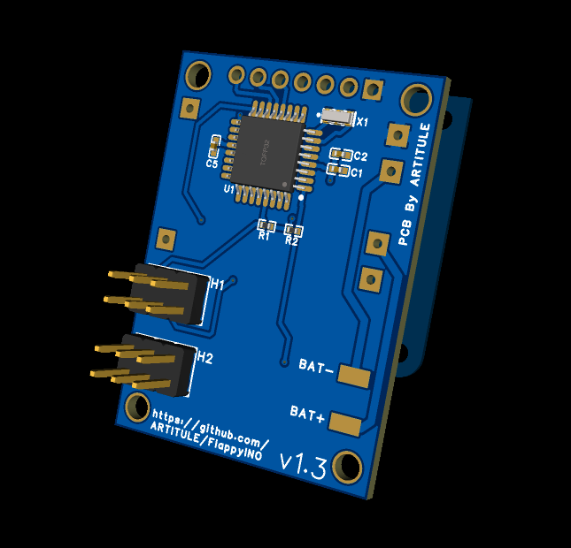
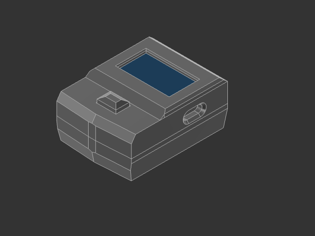

# Arduino Flappy Bird Console

This project is a simple handheld Flappy Bird–inspired game built using an Arduino and a 7-pin SPI display. It recreates the classic side-scrolling obstacle-avoidance gameplay in a compact embedded system.

There is also a PCB based version that is smaller and more power efficient enabling you to play on the go.

Building the PCB version is advised as it is the smaller version and to use the 3D printed case.

See the build video:

## Features

- Smooth side-scrolling graphics on a 7-pin SPI display
- Single-button control
- Lightweight game loop optimized for microcontrollers
- Fully open-source hardware and software

## Hardware Requirements

- **Arduino board** (Uno, Nano, or any ATmega328P-based board)
- **7-pin SPI display**
- **Push button** for player input
- **Breadboard or custom PCB**
- **Power source** (USB or battery)

## PCB

### PCB Hardware Requirements

- **Atmega328P Chip**
- **A 16Mh SMD Crystal Oscillator** (If you are using a Atmega328P that is clocked at 16Mh)
- **6mmx6mm SMD Pushbutton**
- **TP4056 Charging module** (if you are using a small battery you should change the ISET resitor to a 10K one)
- **A Small LI-Po Battery** (Under 40mmx20mmx6mm )
- **A Small 2 Position 6 Pin Switch**
- **3 0402 100nf Ceramic Capasitors** (Not actually needed just improve stability)
- **2 0402 10k Resistors** (Also not technically needed)

### PCB Schematic

For anyone interested here is the schematic.

### Typical Display Pinout

| Display Pin | Description     | Connects To        |
|-------------|-----------------|--------------------|
| VCC         | Power           | 5V or              |
| GND         | Ground          | GND                |
| SCL / SCK   | SPI Clock       | D13 (SCK)          |
| SDA / MOSI  | SPI Data        | D11 (MOSI)         |
| RES         | Reset           | D8                 |
| DC          | Data/Command    | D9                 |
| CS          | Chip Select     | D10                |

### Button Pinout

| PushButton Pin | Connects To  |
|----------------|--------------|
| Pin 1          | GND          |
| Pin 2          | D3           |

## 3D Printed Case

The PCB is made to be used with a 3D printed case. The case files can be found in the '3D Files' folder.

The case is made to be assembled with 4 M3 Heat-set inserts. A battery under 40mm in length, 19mm in width and 5mm in height is preferred.

## Software Requirements

- Arduino IDE
- Display library and button library (Both can be found in the Libraries folder)
- The code (can be found in the FlappyBird_Console_SPI folder)

## Game Mechanics

- There are three difficulties (Easy, Medium, Hard)
- Each press of the button makes the bird flap upward.
- Gravity continuously pulls the bird downward.
- Collision with the ground, ceiling, or a pipe ends the game.
- All high scores for all the difficulties are saved in EEPROM and do not reset
- Upon reaching 200 points you win the game*

*not actually implemented i am working on it

## Installation

1. Clone or download this repository.
2. Drag the display library and the button library into the Libraries folder of the ArduinoIDE.
3. Open any one of the  `.ino` files.
4. Adjust pin definitions to match your wiring if you need to.
5. Upload the sketch to your Arduino.
6. For the PCB you are going to need the USB-ASP and the drivers
7. If you are using a custom Atmega328p Core then you can run the microcontroller with 8Mh internal clock then the 16Mh crystal is not needed.

## Disclaimer

1. For the PCB version the microcontroller clocked at 16Mh might not want to work with the small voltage when the battery is discharged. In that case running it at a 8Mh clock is advised.

## Contributing

Pull requests are welcome.
